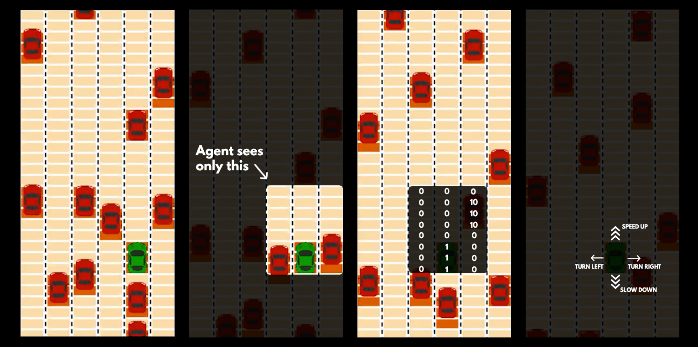

# DeepQLearning_Driver

[Intro](link) - [Game](#game) - [Model used](#model-used) - [How to run](#how-to-run)

---

## Intro
Implementation of Deep reinforcement learning (Q-learning) in a self-made game environment of a highway driver. Inspiration taken from [DeepTraffic competition](https://github.com/lexfridman/deeptraffic) with a few tweaks in the rules and features of the game (eg. Agent driver can not now the exact speed of surrounding cars, hence it can not be an input for the Q-learning model). At each time step, the agent chooses to speed up, slow down, turn left or turn right. The goal of the agent is to achieve the highest average speed while avoiding accidents with surrounding cars.

## Game
Game is built with [PyGame](https://www.pygame.org/news) and is meant to represent a highway with multiple lanes divided into segments and unpredictable surrounding cars. Among the main parameters of the game belongs road difficulty (i.e. how many cars there are), number of lanes, number of segments per lane (i.e. discretization of the q-learning model's input) and range of agent's vision (i.e. input the q-learning model gets).

## Model used
Agent uses [Deep Q-learning](https://arxiv.org/abs/1312.5602) model with two layers (default is 64 and 128 units, respectively), relu activation function, and one output layer with 4 units (action space). Pre-trained weights can be found in `weights/q_learner_latest_weights.pt`. Input of this model (state) consists of array with agent's visible segments on the road (0 if vacant, 1 for the place of the agent, 10 for surrounding car, -10 for out of the road) and agent's current speed (scaled down for stability).

## How to run
`python run.py [-h] [--mode MODE_TO_RUN] [--episodes NUM_OF_EPISODES]  
              [--difficulty DIFFICULTY_OF_ROAD] [--weights PATH_TO_WEIGHTS] [--cpu_only]  
              [--slow] [--silent]`

This script runs the highway agent with the Deep Q-learning model.

**Optional arguments:**  
  &nbsp;&nbsp;&nbsp;&nbsp;&nbsp;&nbsp;-h, --help            show this help message and exit  
  &nbsp;&nbsp;&nbsp;&nbsp;&nbsp;&nbsp;--mode MODE           Mode of the script to run (Either 'train' or 'test'), default: 'train'  
  &nbsp;&nbsp;&nbsp;&nbsp;&nbsp;&nbsp;--episodes EPISODES   Number of road runs to run, default: 1000  
  &nbsp;&nbsp;&nbsp;&nbsp;&nbsp;&nbsp;--difficulty DIFFICULTY
                        Difficulty of the road (number of surrounding cars),
                        default: 2  
  &nbsp;&nbsp;&nbsp;&nbsp;&nbsp;&nbsp;--weights WEIGHTS     Path to pre-trained weights. When not specified, the
                        model learns from scratch.                       
  &nbsp;&nbsp;&nbsp;&nbsp;&nbsp;&nbsp;--cpu_only            Include for using only CPU  
  &nbsp;&nbsp;&nbsp;&nbsp;&nbsp;&nbsp;--slow                Include for slowing down the road simulation  
  &nbsp;&nbsp;&nbsp;&nbsp;&nbsp;&nbsp;--silent              Include for keeping the logs from the progress of agent's
                        road run silent
